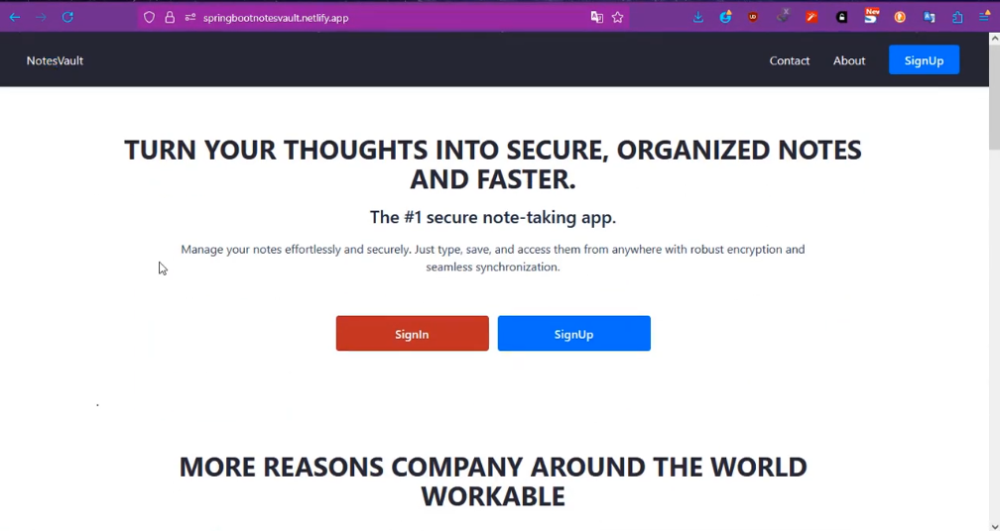
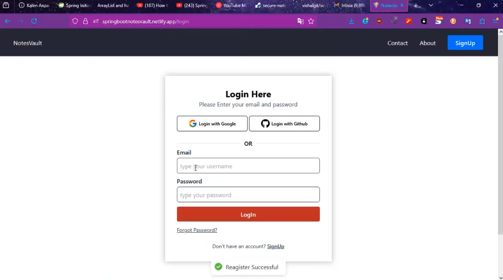
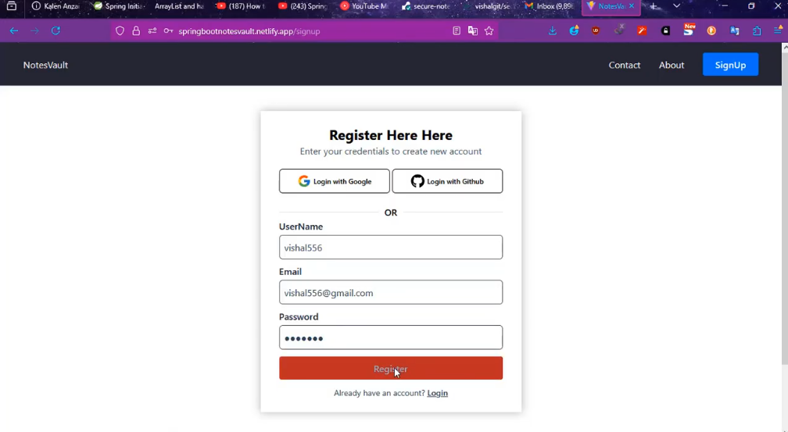
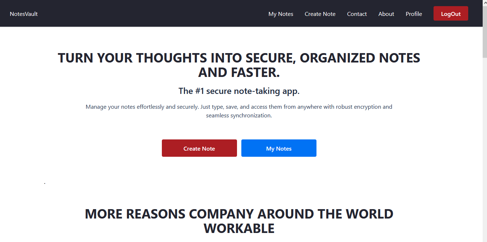
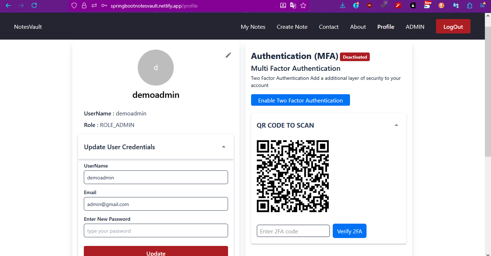
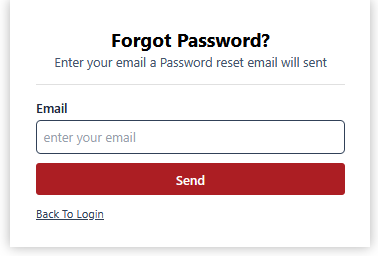
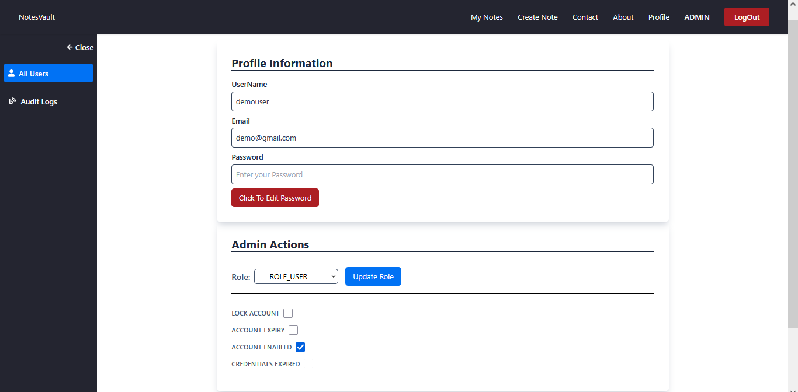
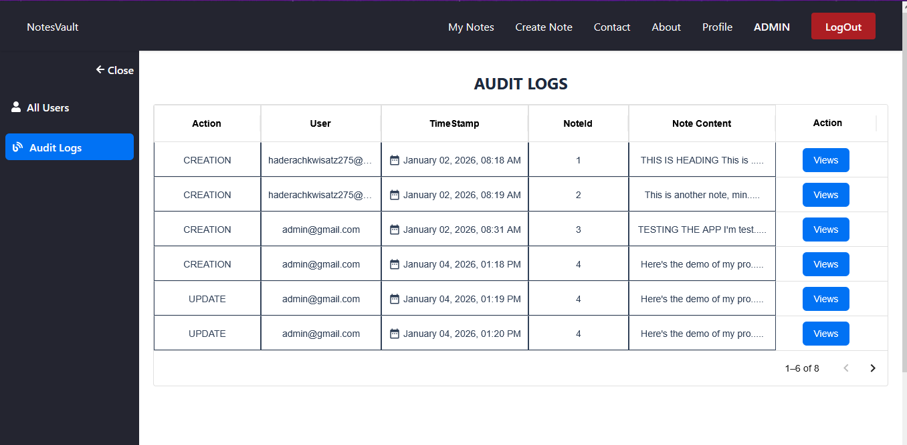

# 🔐 Secure Notes Vault – Spring Boot & React Full-Stack Application

A secure, production-ready **full-stack notes management application** built using **Spring Boot** and **React**, focused on **security, auditing, and role-based access control**.  
The system implements **JWT + OAuth2 authentication**, **Two-Factor Authentication (2FA)**, **email-based password recovery**, and a **comprehensive audit logging mechanism**.

---

## 🎥 Project Demo

Watch the demo videos here:

- **Project Demo (YouTube)**  
  ▶️ [Spring Boot + React Full-Stack Application Demo](https://youtu.be/d7Ovd-UIWqQ)

- **Project Demo (LinkedIn)**  
  ▶️ [Spring Boot + React Full-Stack Application Demo](https://www.linkedin.com/posts/vishal-choudhary-b9089a328_springboot-backenddevelopment-react-activity-7363568942138687488-cjWP?utm_source=share&utm_medium=member_desktop&rcm=ACoAAFK2gxwB_oR_kc6PPGNS2vW_OU8PvCYaffM)

---

## 🌐 Live Demo

🔗 **Hosted Application**  
https://springbootnotesvault.netlify.app/

### Demo Credentials (for testing)

**User**
- Email: `demo@gmail.com`
- Password: `demo123`

**Admin**
- Email: `admin@gmail.com`
- Password: `admin123`

---

## 🚀 Key Features

### 🔐 Authentication & Security
- JWT-based authentication for secure API access
- OAuth2 support for modern login flows
- Two-Factor Authentication (2FA)
- Role-Based Access Control (RBAC) – **Admin & User**
- Secure password hashing with industry-standard algorithms

---

### 📧 Email Services
- Password reset via email
- Secure OTP / token-based verification
- Safe password recovery workflow

---

### 🧾 Audit Logging System
- Tracks critical user actions:
  - Login events
  - Profile updates
  - Deletions
  - Admin activities
- Admin-only access to audit logs
- Filtering and monitoring for accountability

---

### 👤 User Profile Management
- Update username, password, and profile details
- Re-authentication for sensitive changes
- Email verification for account updates
- Optional 2FA management

---

### 📝 Notes Module (CRUD)
- Create, read, update, and delete notes
- Notes linked to authenticated users
- JWT-protected REST endpoints
- Clean and responsive React UI

---

### 🛠️ Admin Panel
- User management
- Role updates
- Audit log monitoring
- Activity tracking
- Admin-only protected routes

---

### ⚡ Additional Highlights
- Clean REST API design using Spring Boot
- React frontend with protected routes
- Modular architecture (Controller → Service → Repository)
- Centralized exception handling & validation
- Scalable design, microservice-ready

---

## 🖼️ Application Screenshots

### 🏠 Landing & Authentication

| Homepage | Login | Register |
|--------|-------|----------|
|  |  |  |

---

### 📒 Notes Dashboard

| User Dashboard |
|---------------|
|  |

---

### 👤 User Profile & Security

| Profile & 2FA |
|--------------|
|  |

---

### 🔁 Password Recovery

| Forgot Password |
|----------------|
|  |

---

### 🛠️ Admin Panel & Logs

| User Management | Audit Logs |
|-----------------|-----------|
|  |  |

---

### ☁️ DevOps & Deployment

| Docker Repository |
|------------------|
|  |

---

## 🧱 Tech Stack

**Backend**
- Java 21
- Spring Boot
- Spring Security
- JWT & OAuth2
- PostgreSQL
- JPA / Hibernate
- Java Mail

**Frontend**
- React, Tailwind
- Protected Routes
- REST API Integration

**Infrastructure**
- Docker
- Cloud Hosting
- CI/CD-ready setup

